#  CyberSight AI

### Enterprise Cyber Threat Analytics Platform using Machine Learning, SQL, Power BI & Streamlit

<p align="center">


<a href="YOUR_STREAMLIT_LINK">

</a>

</p>

---
#  Tagline

**CyberSight AI** is an end-to-end cybersecurity analytics platform that integrates **Machine Learning**, **SQL Analytics**, **Power BI**, and **Streamlit** to automatically detect and classify malicious network traffic across **10 attack categories** using the **UNSW-NB15** intrusion detection dataset.

Unlike traditional intrusion detection systems that only identify whether traffic is malicious, CyberSight AI performs **multiclass cyberattack classification**, enabling security analysts to understand the specific type of attack while providing interactive dashboards and real-time prediction capabilities.
#  Table of Contents

- [Project Overview](#-project-overview)
- [Problem Statement](#-problem-statement)
- [Project Workflow](#-project-workflow)
- [Dataset](#-dataset)
- [Exploratory Data Analysis](#-exploratory-data-analysis)
- [Feature Engineering](#-feature-engineering)
- [ETL Pipeline](#-feature-engineering)
- [SQL Analytics](#-sql-analytics)
- [Power BI Dashboard](#-power-bi-dashboard)
- [Machine Learning Pipeline](#-machine-learning-pipeline)
- [Model Performance](#-model-performance)
- [Streamlit Application](#-streamlit-application)
- [Business Applications](#-business-applications)
- [Future Scope](#-future-scope)
- [About the Author](#-about-the-author)

---
#  Project Overview

CyberSight AI is a complete cybersecurity analytics platform designed to detect, classify, and analyze malicious network traffic using machine learning and business intelligence technologies.

The project was developed using the **UNSW-NB15 Network Intrusion Detection Dataset**, which contains over **257,000 network traffic records** spanning normal activity and multiple cyberattack categories.

Rather than focusing solely on prediction, CyberSight AI combines:

-  Machine Learning for intrusion detection
-  Power BI for cybersecurity analytics
-  SQL for network traffic analysis
-  Streamlit for interactive deployment
-  Data Visualization for threat intelligence

The platform enables security analysts to identify malicious traffic, explore attack trends, compare machine learning models, and perform real-time threat detection through an intuitive web application.

---
#  Problem Statement

Modern organizations generate massive volumes of network traffic every second, making it increasingly difficult for security teams to identify malicious activities in real time. Traditional rule-based Intrusion Detection Systems (IDS) often struggle to detect evolving cyber threats and usually provide only binary classifications (Normal or Attack), offering limited insight into the specific nature of an intrusion.

The cybersecurity industry requires intelligent systems capable of:

- Detecting malicious network traffic automatically.
- Classifying multiple categories of cyberattacks.
- Providing actionable insights for Security Operations Centers (SOC).
- Visualizing attack trends and network behavior.
- Assisting analysts in prioritizing security incidents.

CyberSight AI addresses these challenges by integrating machine learning, SQL analytics, interactive dashboards, and a web-based prediction system into a unified cybersecurity analytics platform.

---

##  Objectives

The primary objectives of CyberSight AI are:

- Develop a multiclass intrusion detection model capable of classifying **10 different network traffic categories**.
- Compare multiple machine learning algorithms to identify the most effective model.
- Perform exploratory data analysis to understand traffic behavior and attack patterns.
- Analyze network traffic using SQL-based cybersecurity queries.
- Design interactive Power BI dashboards for cybersecurity intelligence.
- Deploy the trained machine learning model through an interactive Streamlit web application.
- Enable real-time prediction of uploaded network traffic records.

---

##  Key Achievements

-  Processed over **257,000** network traffic records from the UNSW-NB15 dataset.
-  Performed comprehensive exploratory data analysis and feature engineering.
-  Trained and evaluated **7 machine learning models and variants**, including:
  - Logistic Regression
  - Decision Tree
  - Random Forest
  - XGBoost
  - Tuned Random Forest
  - Tuned XGBoost
  - Balanced Random Forest
-  Selected **Tuned Random Forest** as the final deployment model based on balanced overall performance.
-  Developed SQL-based threat analytics queries for cybersecurity investigation.
-  Built an interactive Power BI dashboard for threat intelligence and network traffic visualization.
-  Deployed a Streamlit application supporting real-time multiclass cyberattack prediction.
#  Project Workflow

CyberSight AI follows a complete end-to-end cybersecurity analytics pipeline, beginning with raw network traffic data and ending with an interactive web application capable of real-time cyberattack prediction.

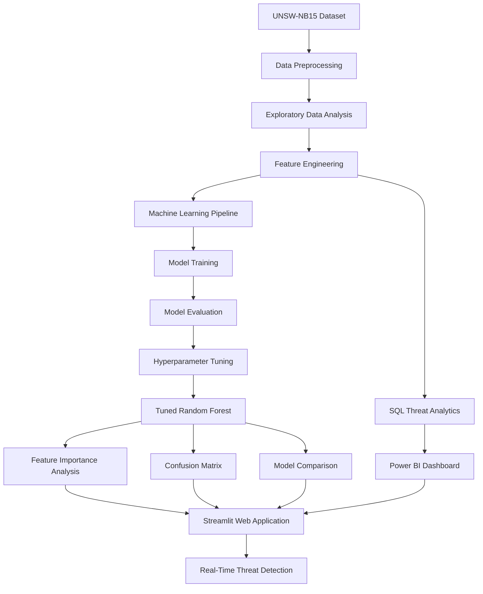

---
#  Dataset

The CyberSight AI platform is built using the **UNSW-NB15 Network Intrusion Detection Dataset**, one of the most widely used benchmark datasets for cybersecurity research and intrusion detection systems.

The dataset was developed by the **Australian Centre for Cyber Security (ACCS)** at the University of New South Wales and contains modern network traffic representing both legitimate user activity and multiple categories of cyberattacks.

Unlike older intrusion detection datasets, UNSW-NB15 captures contemporary network behaviors and attack scenarios, making it well suited for evaluating machine learning-based intrusion detection systems.

---

##  Dataset Source

**Dataset:** UNSW-NB15

**Source:** Kaggle

**Dataset Link:**

```
https://www.kaggle.com/datasets/mrwellsdavid/unsw-nb15
```

---

##  Dataset Overview

| Property | Value |
|----------|-------|
| Domain | Cybersecurity |
| Dataset Type | Network Traffic |
| Learning Task | Multiclass Classification |
| Number of Records | 257,673 |
| Number of Features | 198 (after preprocessing) |
| Target Variable | `attack_cat` |
| Missing Values | Yes |
| Numerical Features | Yes |
| Categorical Features | Yes |

---

##  Target Variable

The objective of CyberSight AI is to classify every network connection into one of **10 traffic categories**.

| Class | Description |
|-------|-------------|
| Analysis | Network analysis attacks |
| Backdoor | Unauthorized remote access |
| DoS | Denial-of-Service attacks |
| Exploits | Software and system exploitation |
| Fuzzers | Fuzz testing attacks |
| Generic | Generic cryptographic attacks |
| Normal | Legitimate network traffic |
| Reconnaissance | Information gathering attacks |
| Shellcode | Malicious shellcode execution |
| Worms | Self-replicating malware |

This makes CyberSight AI a **multiclass intrusion detection system**, enabling more detailed threat identification than traditional binary attack detection.

---

##  Dataset Features

The dataset contains network flow information describing communication between source and destination hosts.

###  Network Features

- Source IP
- Destination IP
- Source Port
- Destination Port
- Protocol
- Service
- Connection State

---

###  Traffic Features

- Source Bytes
- Destination Bytes
- Total Bytes
- Packets
- Packet Size
- Traffic Direction Ratio
- Duration

---

###  Security Features

- Attack Category
- State Transitions
- TTL Values
- Load Statistics
- Connection Counts
- Service Counts

---

###  Statistical Features

- Mean Packet Size
- Standard Deviation
- Packet Loss
- Flow Statistics
- Connection Frequency
- Session Characteristics

---

##  Why UNSW-NB15?

The UNSW-NB15 dataset was selected because it provides several advantages over older intrusion detection datasets:

- Modern and realistic network traffic
- Multiple cyberattack categories
- Balanced representation of normal and malicious traffic
- Rich network flow features
- Widely used benchmark for intrusion detection research
- Suitable for machine learning and deep learning applications

---

##  Attack Categories

The dataset includes ten network traffic classes.

| Category | Type |
|----------|------|
| Normal | Legitimate Traffic |
| Analysis | Attack |
| Backdoor | Attack |
| DoS | Attack |
| Exploits | Attack |
| Fuzzers | Attack |
| Generic | Attack |
| Reconnaissance | Attack |
| Shellcode | Attack |
| Worms | Attack |

These attack categories enable CyberSight AI to perform **fine-grained cyber threat classification**, helping security analysts understand not only whether traffic is malicious but also the specific attack type.

---
#  Exploratory Data Analysis (EDA)

Exploratory Data Analysis was performed to understand the characteristics of the network traffic data before model training.

The analysis included:

- Dataset overview
- Missing value analysis
- Attack category distribution
- Protocol and service analysis
- Feature distributions
- Correlation analysis
- Outlier detection

<p align="center">
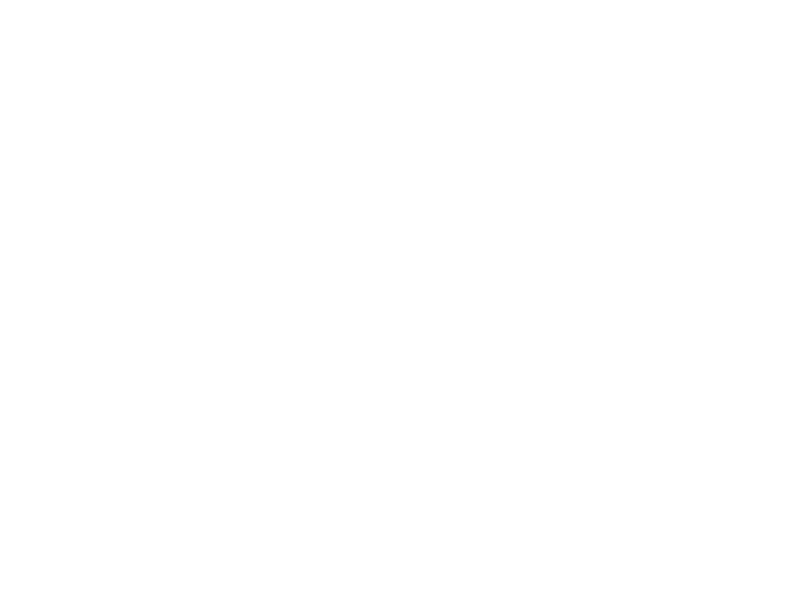
</p>
<p align="center">
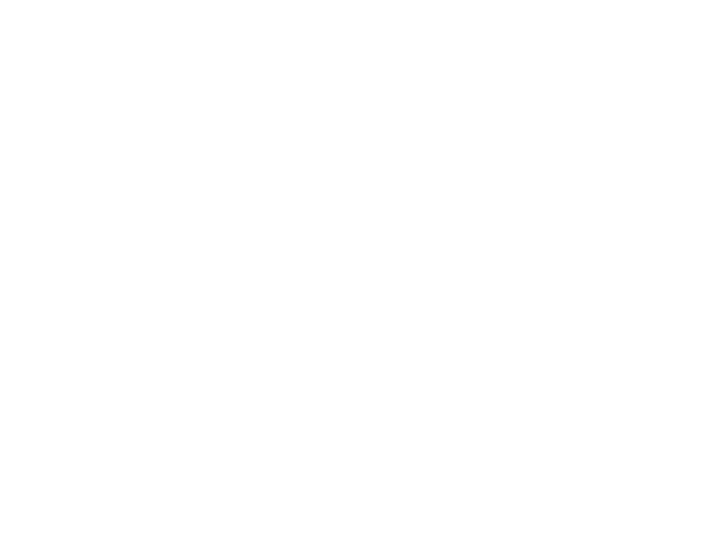
</p>
<p align="center">
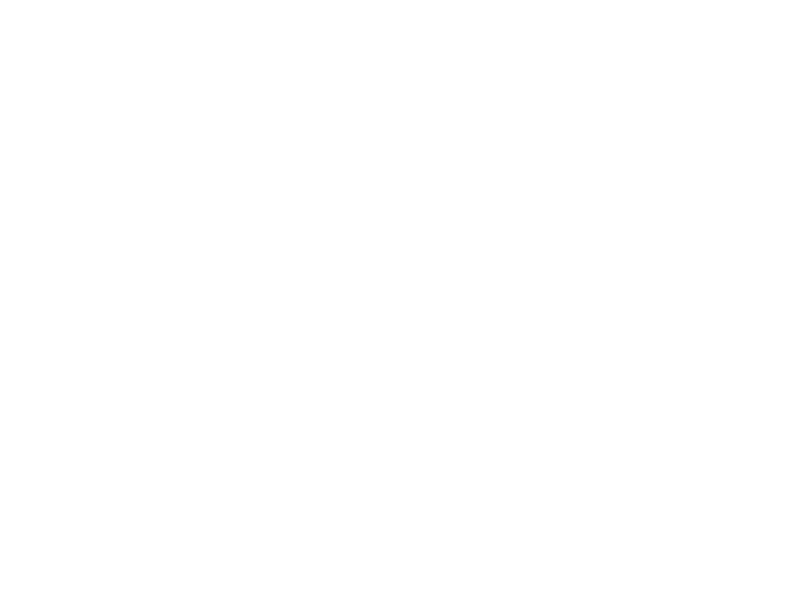
</p>

### Key Insights

- The dataset contains both numerical and categorical features.
- Traffic is distributed across **10 attack categories**.
- Several features required preprocessing and encoding.
- Correlation analysis helped identify relationships between network attributes.

---
# ⚙️ Feature Engineering

Feature engineering was performed to prepare the dataset for machine learning.

The preprocessing pipeline included:

- Removing unnecessary columns
- Handling missing values
- Encoding categorical variables
- Feature scaling
- Train-test split
- Label encoding of attack categories

### Preprocessing Workflow

```text
Raw Dataset
      │
      ▼
Data Cleaning
      │
      ▼
Handle Missing Values
      │
      ▼
Encode Categorical Features
      │
      ▼
Feature Scaling
      │
      ▼
Train-Test Split
      │
      ▼
Processed Dataset
```

These steps ensured consistent data preparation for training and deployment.

---
#  ETL Pipeline

An ETL (Extract, Transform, Load) pipeline was implemented to prepare the UNSW-NB15 dataset for analysis and machine learning.

### Pipeline Steps

- **Extract:** Imported raw network traffic data.
- **Transform:** Cleaned data, handled missing values, encoded categorical features, and prepared the target variable.
- **Load:** Stored the processed dataset for SQL analysis, machine learning, and dashboard development.

```text
Raw Dataset
      │
      ▼
Extract Data
      │
      ▼
Data Cleaning
      │
      ▼
Feature Transformation
      │
      ▼
Processed Dataset
      │
      ├────────► SQL Analytics
      ├────────► Machine Learning
      └────────► Power BI Dashboard
```

---
#  SQL Analytics

SQL was used to analyze network traffic and generate cybersecurity insights from the processed dataset.

### Analysis Performed

- Attack category distribution
- Protocol analysis
- Service-wise traffic analysis
- Network state analysis
- Top attack trends
- Traffic summary statistics

<p align="center">

</p>
<p align="center">
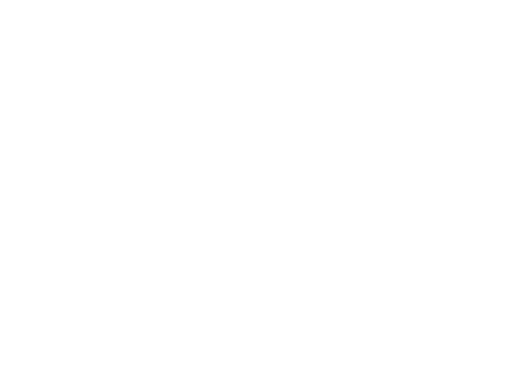
</p>

### Key Insights

- Exploits and Generic attacks were among the most frequent attack categories.
- TCP generated the highest volume of network traffic.
- Protocol and service analysis helped identify suspicious communication patterns.
- SQL queries provided valuable insights for cybersecurity monitoring and reporting.

---
#  Power BI Dashboard

An interactive Power BI dashboard was developed to visualize cybersecurity trends and support data-driven threat analysis.

### Dashboard Features

- Network traffic overview
- Attack category analysis
- Protocol & service distribution
- Threat trends
- Interactive KPIs and filters

<p align="center">
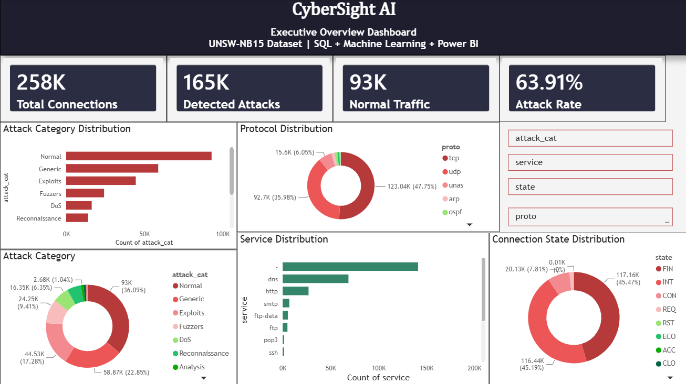
</p>
<p align="center">
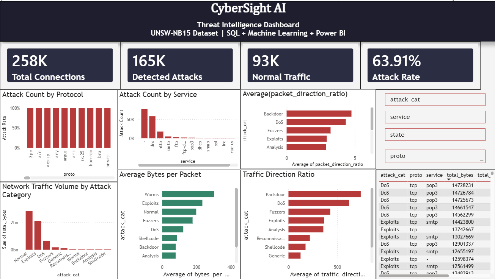
</p>
<p align="center">
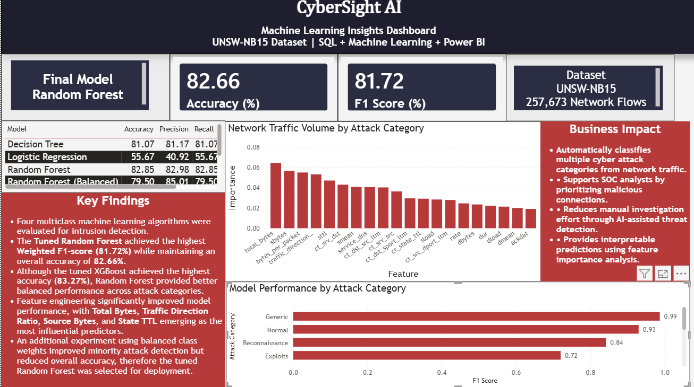
</p>

### Key Insights

- Identified the most frequent attack categories.
- Analyzed protocol and service usage patterns.
- Monitored network traffic trends through interactive visualizations.

---
#  Machine Learning Pipeline

CyberSight AI leverages supervised machine learning to classify network traffic into **10 distinct categories**, enabling fine-grained intrusion detection instead of traditional binary classification.

The machine learning workflow includes data preprocessing, model training, evaluation, hyperparameter tuning, and deployment of the best-performing model.

---

##  Machine Learning Workflow

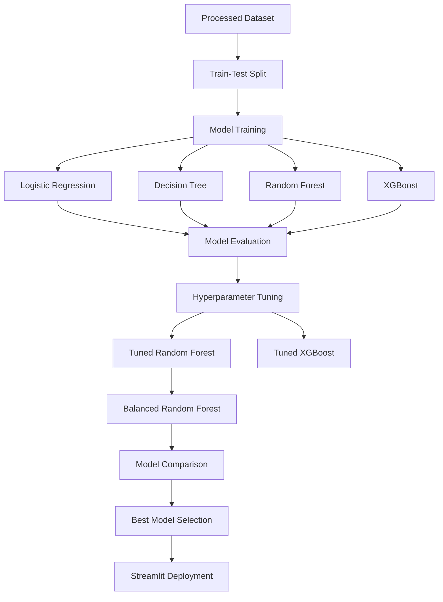

---

##  Machine Learning Models

Several classification algorithms were trained and evaluated to identify the most effective model for multiclass intrusion detection.

### 1️ Logistic Regression

Logistic Regression served as the baseline model for comparison.

**Characteristics**

- Linear classification algorithm
- Fast training and prediction
- Easy to interpret
- Suitable as a baseline model

---

### 2️ Decision Tree

Decision Tree learns decision rules by recursively splitting the feature space.

**Characteristics**

- Captures non-linear relationships
- Easy to visualize
- Handles numerical and categorical features
- Simple and interpretable

---

### 3️ Random Forest

Random Forest combines multiple decision trees to improve prediction accuracy and reduce overfitting.

**Characteristics**

- Ensemble learning algorithm
- Robust against overfitting
- Handles high-dimensional data
- Provides feature importance scores
- Strong performance on tabular datasets

---

### 4️ XGBoost

XGBoost is a gradient boosting algorithm known for its high predictive performance and efficiency.

**Characteristics**

- Gradient boosting framework
- Excellent predictive capability
- Regularization to reduce overfitting
- Efficient handling of structured datasets

---

##  Hyperparameter Tuning

To improve predictive performance, Random Forest and XGBoost were optimized using hyperparameter tuning.

### Tuned Parameters

- Number of Trees (`n_estimators`)
- Maximum Tree Depth (`max_depth`)
- Minimum Samples per Split (`min_samples_split`)
- Minimum Samples per Leaf (`min_samples_leaf`)
- Maximum Features (`max_features`)
- Learning Rate (XGBoost)
- Subsample Ratio
- Column Sampling

Hyperparameter tuning improved the model's ability to generalize while maintaining strong multiclass classification performance.
<p align="center">
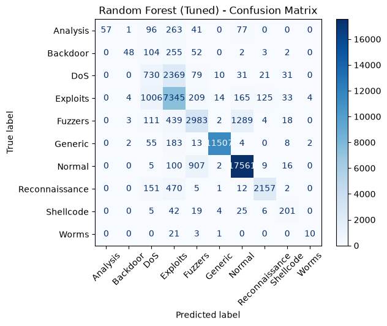
</p>
<p align="center">
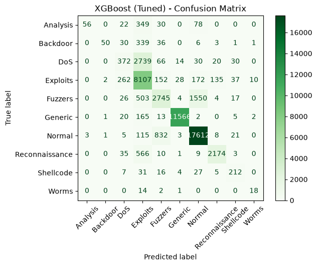
</p>
---

##  Handling Class Imbalance

Since the dataset contains attack categories with varying sample sizes, an additional **Balanced Random Forest** model was evaluated using class weighting.

This experiment improved prediction for minority attack categories but slightly reduced overall accuracy.

After comparing all models, the tuned Random Forest provided the best balance between overall performance and multiclass classification.

<p align="center">
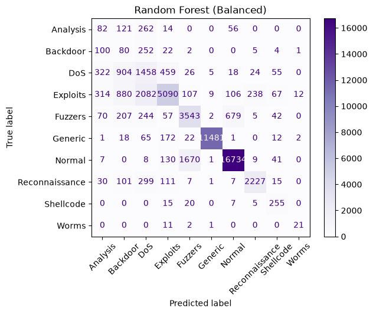
</p>

---
#  Model Performance

Each model was evaluated using multiple performance metrics to ensure a comprehensive assessment of multiclass classification performance.

### Evaluation Metrics

- Accuracy
- Precision
- Recall
- Weighted F1-Score
- Confusion Matrix
- Classification Report

---

##  Model Comparison

<p align="center">
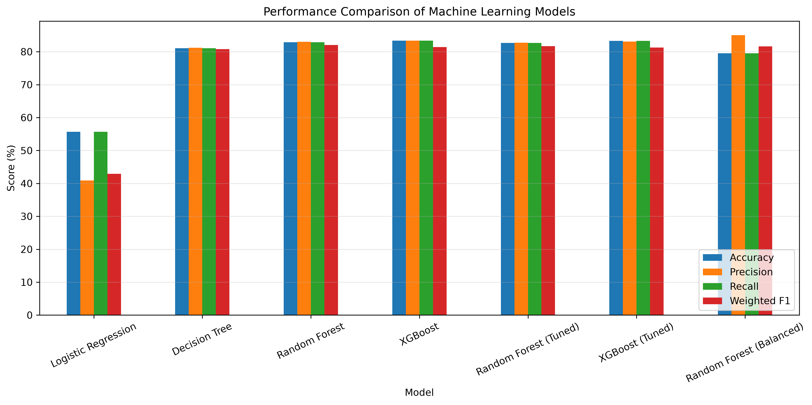
</p>

| Model | Accuracy | Precision | Recall | Weighted F1 |
|--------|---------:|----------:|--------:|------------:|
| Logistic Regression | 55.67% | 40.92% | 55.67% | 42.91% |
| Decision Tree | 81.07% | 81.17% | 81.07% | 80.75% |
| Random Forest | 82.85% | 82.98% | 82.85% | 82.03% |
| XGBoost | **83.38%** | **83.39%** | **83.38%** | 81.40% |
| Tuned Random Forest | 82.66% | 82.70% | 82.66% | **81.72%** |
| Tuned XGBoost | 83.27% | 83.11% | 83.27% | 81.26% |
| Balanced Random Forest | 79.50% | 85.01% | 79.50% | 81.61% |

---

##  Final Model Selection

After evaluating all models, **Tuned Random Forest** was selected as the final deployment model.

### Why Tuned Random Forest?

- Best overall balance across evaluation metrics.
- Strong multiclass classification performance.
- Better generalization on unseen network traffic.
- Reduced overfitting through hyperparameter tuning.
- Reliable performance across both majority and minority attack categories.

---

##  Feature Importance

Random Forest provides feature importance scores that help identify the most influential network traffic attributes.

<p align="center">
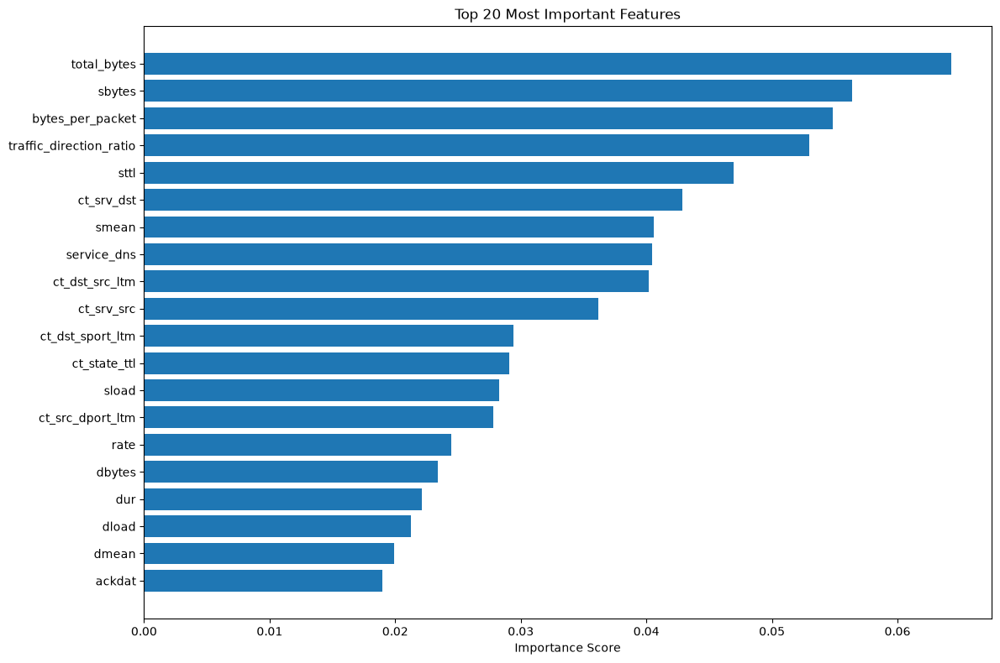
</p>

Feature importance analysis improves the interpretability of the model by showing which features contribute most to cyberattack classification.

---

##  Model Deployment

The final deployment package includes:

- Tuned Random Forest model
- Feature list
- Label Encoder
- Streamlit prediction engine

The trained model is integrated into the Streamlit application, enabling users to upload network traffic data and receive real-time multiclass cyberattack predictions with confidence scores.

---
#  Streamlit Application

CyberSight AI is deployed as an interactive **Streamlit** web application that enables users to perform real-time multiclass cyberattack classification on network traffic data. The application combines machine learning, interactive visualizations, and an intuitive user interface to simplify cybersecurity analysis.

---

##  Application Features

-  Upload network traffic CSV files
-  Real-time multiclass cyberattack prediction
-  Prediction confidence scores
-  Attack category distribution visualization
-  Model comparison dashboard
-  Feature importance visualization
-  Confusion matrix display
-  Download prediction results

---

##  Application Workflow

```text
Upload CSV File
        │
        ▼
Validate Input Data
        │
        ▼
Feature Preprocessing
        │
        ▼
Tuned Random Forest Model
        │
        ▼
Attack Category Prediction
        │
        ▼
Confidence Score
        │
        ▼
Prediction Summary
        │
        ▼
Interactive Visualizations
```

---

##  Sample CSV File

A sample dataset is included in this repository to help users test the prediction system.

 **Download Sample File**

 **[sample_network_traffic.csv](sample_data/sample_network_traffic.csv)**

> The uploaded CSV file must follow the same feature structure used during model training.

---

##  Application Preview

<p align="center">
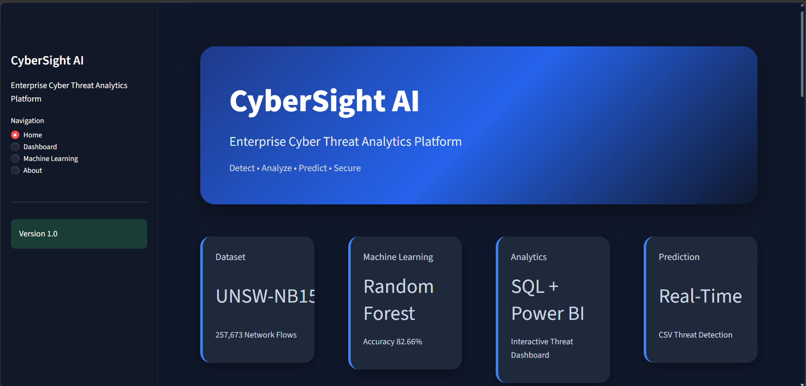
</p>

---

##  Technologies Used

| Component | Technology |
|-----------|------------|
| Web Framework | Streamlit |
| Machine Learning | Scikit-learn |
| Model | Tuned Random Forest |
| Data Processing | Pandas |
| Visualization | Plotly |
| Database | SQLite |
| Model Serialization | Joblib |

---

##  Key Capabilities

- Detects and classifies **10 different network traffic categories**
- Supports **batch prediction** using CSV uploads
- Displays **prediction confidence** for every record
- Generates **interactive attack distribution charts**
- Provides **model performance insights** through visualizations
- Enables quick and efficient cybersecurity threat analysis

---
#  Business Applications

CyberSight AI can be applied across various cybersecurity domains to support proactive threat detection and network monitoring.

### Applications

- Security Operations Centers (SOC)
- Intrusion Detection Systems (IDS)
- Enterprise Network Security
- Threat Intelligence
- Security Monitoring
- Cybersecurity Research
- Incident Response
- Network Traffic Analysis

### Benefits

- Faster threat detection
- Improved cyberattack classification
- Reduced manual analysis
- Better security decision-making
- Data-driven cybersecurity insights

---
#  Future Scope

CyberSight AI can be further enhanced with several advanced capabilities, including:

- Deep Learning models (LSTM, CNN, Transformer)
- Real-time network packet monitoring
- Explainable AI using SHAP or LIME
- Cloud deployment on AWS or Azure
- Live threat intelligence integration
- SIEM integration (Splunk, ELK)
- Automated alert generation
- Role-based authentication and user management

---
#  About the Author

**Developed by:** Gurleen Kaur

Final Year B.Tech (Electronics & Computer Engineering)  
Guru Nanak Dev University, Amritsar

### Technical Skills

- Python
- Machine Learning
- SQL
- Power BI
- Streamlit
- Data Analytics
- Cybersecurity Analytics

### Connect With Me

- GitHub: **https://github.com/GurleenKaur00**
- LinkedIn: **https://www.linkedin.com/in/gurleen-kaur-sandhu/**
- Email: **gurleenkaursandhu2210@gmail.com**

---
